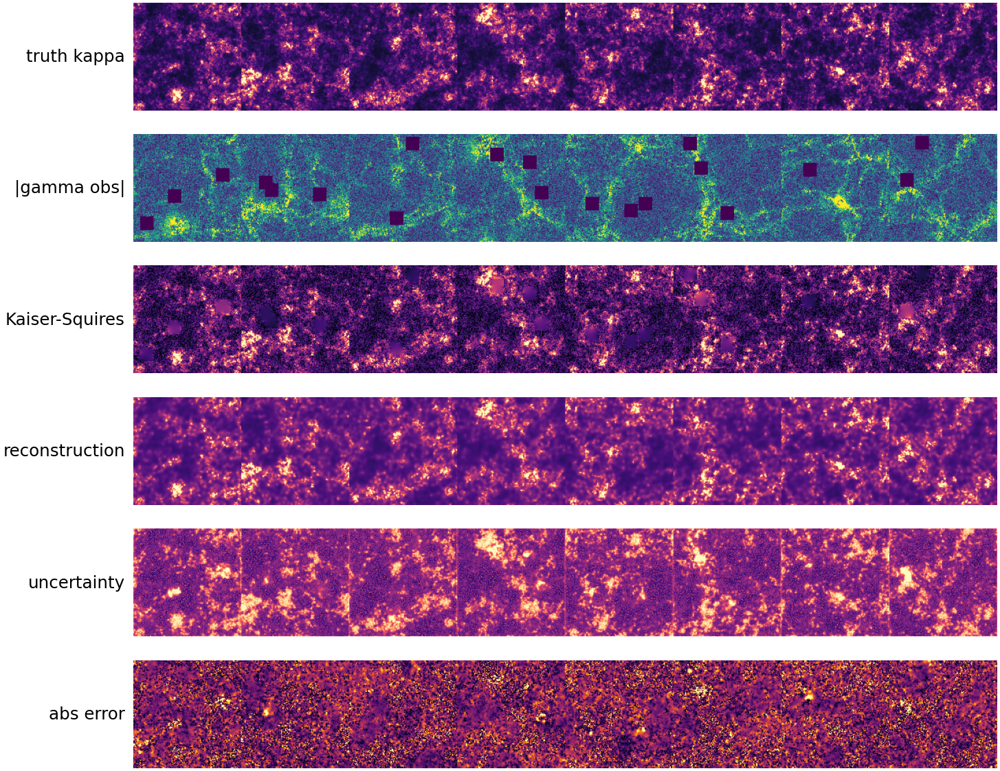
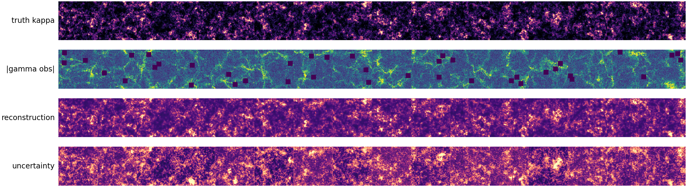
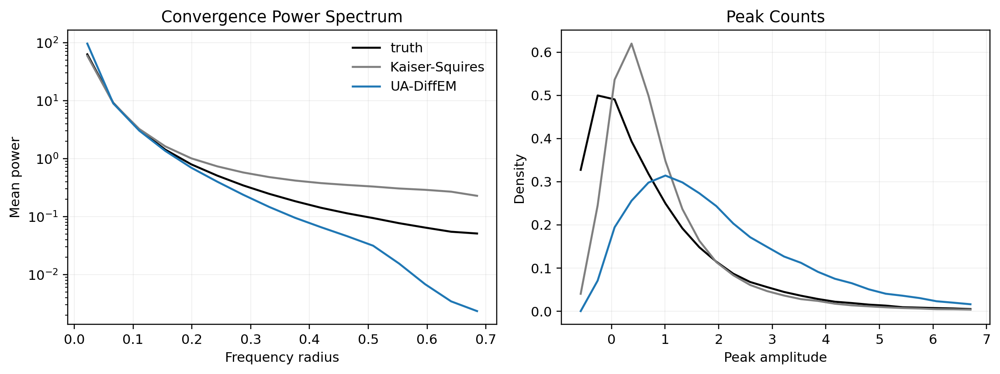
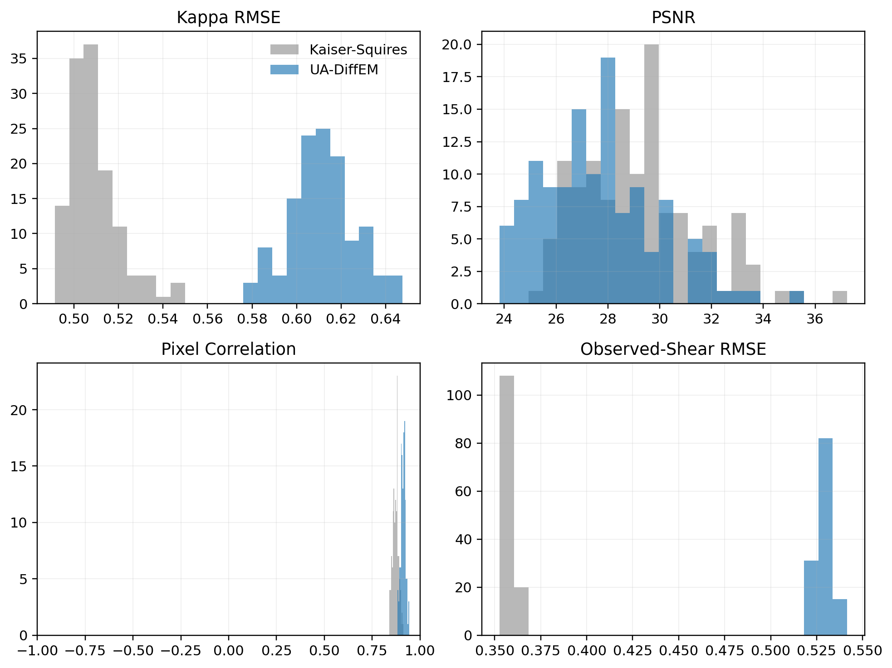

# Introduction to the shear problem

These notes are a gentle entry point for the weak-lensing part of `ua_diffem`.
They assume comfort with linear algebra, Fourier transforms, and basic
probability, but not prior exposure to gravitational lensing.

The short version: this project asks a posterior model to infer a hidden
convergence map, `kappa`, from noisy and partially masked observations of the
two-component shear field, `gamma = (gamma1, gamma2)`. The classical
Kaiser-Squires method gives a useful linear baseline. UA-DiffEM tries to learn
a richer conditional distribution over plausible `kappa` maps.

## The project data at a glance

The included figures are shear-run outputs copied from
`runs/ua_diffem/my_shear_run2/`. They show the actual objects this project
trains and evaluates on: true convergence, observed shear magnitude,
Kaiser-Squires reconstructions, UA-DiffEM reconstructions, uncertainty, and
weak-lensing summary statistics.

For fresh synthetic teaching figures, use
[`make_shear_figures.py`](make_shear_figures.py). By default it searches for a
local shear run config under `runs/ua_diffem/`; if none is available, it falls
back to the defaults in [`../train_shear.py`](../train_shear.py). It requires
the project scientific Python environment, including `numpy` and `matplotlib`.

```bash
python ua_diffem/notes/make_shear_figures.py
```



The rows show held-out truth `kappa`, observed shear magnitude `|gamma obs|`,
the Kaiser-Squires baseline, the UA-DiffEM reconstruction, predicted
uncertainty, and absolute error. In real weak lensing, convergence is a
projected mass-density contrast along the line of sight. Here it is a
log-normal random field generated in [`../shear.py`](../shear.py), chosen
because matter density is non-Gaussian and spatially correlated.



This is the basic data-generation pipeline:

1. Sample a clean `kappa` map.
2. Apply the Kaiser-Squires shear operator to obtain true `gamma1` and
   `gamma2`.
3. Add Gaussian shear noise.
4. Apply rectangular missing-data masks.
5. Form a Kaiser-Squires inverse reconstruction as a baseline.

The training preview is useful because it mirrors the rows saved during
[`../train_shear.py`](../train_shear.py): truth, observed shear magnitude,
Kaiser-Squires, current posterior reconstruction, and uncertainty.



Pixelwise images are not the only thing that matters. Weak-lensing analyses
often summarize fields through statistics such as power spectra and peak
counts. These plots compare truth, Kaiser-Squires, and UA-DiffEM on those
summaries.



The quantitative reconstruction tests compare UA-DiffEM and Kaiser-Squires
across image-space and measurement-space metrics. These histograms are a quick
way to see whether improvements are typical or driven by a few examples.

## Weak lensing in one page

Mass curves spacetime, so light from distant galaxies is deflected by matter
between the galaxy and the observer. Weak gravitational lensing is the regime
where these deflections are small. We do not see the unlensed galaxy directly;
we see a slightly magnified and sheared image.

For a small image patch, the lens mapping can be summarized by the Jacobian

$$
A =
\begin{pmatrix}
1 - \kappa - \gamma_1 & -\gamma_2 \\
-\gamma_2 & 1 - \kappa + \gamma_1
\end{pmatrix}.
$$

The terms mean:

- `kappa`: convergence, an isotropic focusing or magnification term. It traces
  projected mass density up to lensing degeneracies.
- `gamma1`: shear aligned with the coordinate axes. Positive and negative
  values stretch along orthogonal directions.
- `gamma2`: shear aligned at 45 degrees relative to the axes.
- `$\gamma = \gamma_1 + i \gamma_2$`: complex shear, a compact way to represent the
  two components.

In observational cosmology, shear is inferred statistically from many galaxy
ellipticities. Individual galaxies have their own unknown intrinsic shapes, so
real surveys average over many sources. This repository uses a simplified
pixel-level toy problem: the shear map is generated directly from `kappa`, then
Gaussian noise and masks are added.

## From lensing potential to shear

Both convergence and shear can be written as second derivatives of a projected
lensing potential `psi`:

$$
\kappa = \frac{1}{2}\left(\psi_{11} + \psi_{22}\right), \qquad
\gamma_1 = \frac{1}{2}\left(\psi_{11} - \psi_{22}\right), \qquad
\gamma_2 = \psi_{12}.
$$

This is why `kappa` and `gamma` contain related information. They are different
linear combinations of the same second-derivative field.

In Fourier space, derivatives become multiplication by frequency. If
$\boldsymbol{\ell} = (\ell_x, \ell_y)$ and $\ell^2 = \ell_x^2 + \ell_y^2$,
then this project uses

$$
\hat{\gamma}_1(\boldsymbol{\ell}) = D_1(\boldsymbol{\ell}) \, \hat{\kappa}(\boldsymbol{\ell}),
\qquad
\hat{\gamma}_2(\boldsymbol{\ell}) = D_2(\boldsymbol{\ell}) \, \hat{\kappa}(\boldsymbol{\ell}),
$$

with

$$
D_1(\boldsymbol{\ell}) = \frac{\ell_x^2 - \ell_y^2}{\ell^2},
\qquad
D_2(\boldsymbol{\ell}) = \frac{2 \ell_x \ell_y}{\ell^2}.
$$

The zero-frequency mode has $\ell^2 = 0$, so it is set to zero in code. This is
not just a numerical annoyance: shear cannot determine the absolute constant
offset of `kappa`.

Relevant code:

- [`../shear.py`](../shear.py): `ks_kernel_numpy`, `kaiser_squires_shear_numpy`,
  `kaiser_squires_inverse_jax`
- [`../train_shear.py`](../train_shear.py): construction of the synthetic
  training set and observation channel

## Kaiser-Squires reconstruction

Kaiser-Squires is the classical Fourier-domain inversion from shear to
convergence. Given observed shear, it estimates

$$
\hat{\kappa}_{\mathrm{KS}}(\boldsymbol{\ell}) =
D_1(\boldsymbol{\ell}) \, \hat{\gamma}_1(\boldsymbol{\ell}) +
D_2(\boldsymbol{\ell}) \, \hat{\gamma}_2(\boldsymbol{\ell}).
$$

For a full, noiseless, periodic field this is a natural inverse of the forward
operator, apart from the missing zero mode. In this project it is used as both:

- a baseline reconstruction to compare against the learned posterior;
- an optional bootstrap reconstruction for the first DiffEM E-step, when the
  flow model is still untrained.

Why Kaiser-Squires is not enough here:

- noise in `gamma` becomes structured artifacts in `kappa`;
- masks break the assumptions of a clean Fourier inversion;
- finite image boundaries create ringing and leakage;
- the inverse gives a point estimate, not a calibrated posterior uncertainty.

Those are exactly the gaps a probabilistic reconstruction method can try to
fill.

## What `gamma` means in this repository

The observation channel in [`../shear.py`](../shear.py) computes

$$
\begin{aligned}
\gamma_{\mathrm{true}} &= \mathrm{KS\_shear}(\kappa_{\mathrm{true}}), \\
\eta &\sim \mathcal{N}(0, \sigma_\gamma^2 I), \\
\gamma_{\mathrm{obs}} &= \left(\gamma_{\mathrm{true}} + \eta\right) \odot m, \\
\mathrm{condition} &= \gamma_{\mathrm{obs}} / \gamma_{\mathrm{scale}}.
\end{aligned}
$$

The model condition has two channels: `gamma1` and `gamma2`. The mask is used to
zero out unobserved shear pixels. The code standardizes the target `kappa`
fields for training, but most plots convert back to physical `kappa` units.

The code uses shear `gamma`, not reduced shear

$$
g = \frac{\gamma}{1 - \kappa}.
$$

Real weak-lensing analyses often work with reduced shear because that is closer
to what galaxy shapes measure. For this synthetic benchmark, using `gamma`
keeps the forward model linear and makes the Kaiser-Squires baseline direct.

## Spherical note

The full-sky HEALPix / GLASS / CAMB pipeline is documented separately in
[`spherical_weak_lensing.md`](spherical_weak_lensing.md). That note is the
best place to review what the spherical code is doing from a physics
perspective. It includes:

- the convergence and source-distribution equations behind the CAMB-backed
  `C_ell`;
- the harmonic-space relation between spherical convergence and shear;
- the exact low-`ell` projection, noise model, mask model, and bootstrap
  inversion used by the code;
- the provenance of the default cosmological parameters.

## Why this is an inverse problem

The forward direction is easy:

$$
\kappa \to \gamma \to \text{noisy, masked } \gamma_{\mathrm{obs}}.
$$

The inverse direction is hard:

$$
\gamma_{\mathrm{obs}} \to \text{plausible } \kappa \text{ maps}.
$$

Many different `kappa` maps can be consistent with nearly the same noisy,
masked observation. Some information is physically absent, some is hidden by
the mask, and some is drowned by noise. A single reconstruction can therefore
look confident even when several alternatives remain plausible.

UA-DiffEM treats the target as a conditional distribution:

$$
p_\theta\!\left(\kappa \mid \gamma_{\mathrm{obs}}\right).
$$

The E-step samples reconstructions from the current posterior model. The M-step
trains the uncertainty-aware flow on those reconstructed clean fields passed
through the known corruption channel. The result is not just a mean image: the
sampling process also returns uncertainty estimates used by the evaluation
suite.

## Evaluation scripts

The shear evaluation folders are a good way to connect the theory to project
outputs:

- [`../shear_tests/visual_examples/run.py`](../shear_tests/visual_examples/run.py):
  truth, observed shear magnitude, Kaiser-Squires, UA-DiffEM reconstruction,
  uncertainty, and absolute error.
- [`../shear_tests/quantitative_reconstruction/run.py`](../shear_tests/quantitative_reconstruction/run.py):
  RMSE, PSNR, correlation, and forward-model residuals against the observed
  shear.
- [`../shear_tests/weak_lensing_statistics/run.py`](../shear_tests/weak_lensing_statistics/run.py):
  power spectra and peak counts, which are closer to weak-lensing science
  summaries than pixelwise errors alone.
- [`../shear_tests/uncertainty_aware/run.py`](../shear_tests/uncertainty_aware/run.py):
  calibration and risk-coverage diagnostics for the predicted uncertainty.

## Glossary

| Term | Meaning in these notes |
| --- | --- |
| `kappa` | Convergence: projected mass-density-like scalar field. |
| `gamma1`, `gamma2` | Two Cartesian components of shear. |
| complex `gamma` | `gamma1 + i gamma2`; useful because shear has orientation and amplitude. |
| mask | Pixels where shear is missing; represented as zeros in observed shear. |
| `gamma_scale` | Dataset normalization used to keep conditioning values numerically tame. |
| Kaiser-Squires | Fourier method for converting between convergence and shear. |
| posterior | Distribution over plausible clean `kappa` maps given the observed shear. |
| uncertainty map | Per-pixel spread returned by the UA-flow sampler. |

## Suggested first pass for a new student

1. Read [`../shear.py`](../shear.py) from top to bottom. It is the smallest
   complete description of the physics-inspired data model.
2. If you are reviewing the full-sky pipeline, read
   [`spherical_weak_lensing.md`](spherical_weak_lensing.md) next.
3. Run `python ua_diffem/notes/make_shear_figures.py` and inspect the PNGs in
   `ua_diffem/notes/images/`.
4. Open a saved `runs/ua_diffem/<run_name>/config.json` and match each dataset
   parameter to the glossary above.
5. Run `python -m ua_diffem.shear_tests.visual_examples.run --run_name <run_name>`
   for a trained run, then compare its output with the forward-model figure in
   these notes.
6. Only after that, read the DiffEM training loop in [`../train_shear.py`](../train_shear.py).
